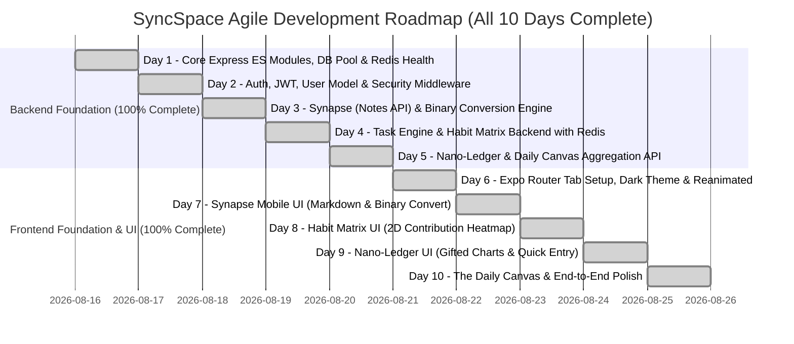

# SyncSpace: Architectural Blueprint & Agile Roadmap

SyncSpace is a unified personal operating system integrating **Synapse** (rapid capture notes & binary conversion), **Task Engine** (priority & recurrence), **Habit Matrix** (2D GitHub-style streak grid), **Nano-Ledger** (financial budget & analytics), and **The Daily Canvas** (unified CURRENT_DATE dashboard).

---

## 1. High-Concurrency Architecture (500+ Concurrent Users)

To handle 500+ concurrent mobile clients with sub-50ms latency:
1. **Connection Pooling**: PostgreSQL `pg.Pool` tuned with `max: 50` connections, connection timeout, and idle pool management.
2. **Two-Tier Caching via Redis (`ioredis`)**:
   - **Daily Canvas Cache**: Cache pre-computed aggregated daily timeline for `CURRENT_DATE` per user with short TTL (60s) or event-driven cache invalidation upon any task/habit/expense mutation.
   - **Rate Limiting**: Distributed rate limiting powered by `express-rate-limit` + `rate-limit-redis` to prevent burst storms.
   - **Session & User Metadata Cache**: Avoid repeated DB lookups for user preferences and tokens.
3. **Database Optimization**:
   - Composite indexes on `(user_id, date)` and `(user_id, status, due_date)`.
   - Connection lifecycle management and transactions for multi-entity writes (e.g., Synapse binary note-to-task conversion).

---

## 2. Day-by-Day Agile Roadmap (100% Completed)

### Completed Days Summary:

- **Day 1 (Complete)**: Backend Foundation — ES Modules, PostgreSQL Connection Pool (`max: 50`), Redis Client, Rate Limiting, Health Check API.
- **Day 2 (Complete)**: Authentication & User Profile — JWT auth, bcrypt password hashing, token validation middleware, user timezone/currency preferences (29 passing tests).
- **Day 3 (Complete)**: Synapse Module (Notes API) — Markdown note CRUD, tagging, and atomic "Binary Conversion" PostgreSQL transaction (33 passing tests).
- **Day 4 (Complete)**: Task Engine & Habit Matrix Backend — Tasks CRUD, Habits CRUD, daily check-in logs, Redis active streak caching, 2D GitHub-style heatmap data (43 passing tests).
- **Day 5 (Complete)**: Nano-Ledger & Daily Canvas Backend — Categories with budget limits, Income/Expense transactions, monthly financial analytics, and the high-speed cached `GET /api/canvas/today` aggregation endpoint (41 passing tests).
- **Day 6 (Complete)**: Mobile Shell & Design System — Expo Router 5-tab layout, glassmorphic obsidian dark theme, Reanimated micro-interactions, API client with interceptors.
- **Day 7 (Complete)**: Synapse Mobile Screen — Markdown rapid capture, tag chips, animated binary swipe/button conversion to task modal.
- **Day 8 (Complete)**: Habit Matrix Mobile Screen — 2D GitHub-style contribution heatmap grid, daily haptic toggles, streak badges.
- **Day 9 (Complete)**: Nano-Ledger Mobile Screen — Frictionless numerical keypad bottom sheet, category spending breakdown & budget progress ring.
- **Day 10 (Complete)**: The Daily Canvas & System Polish — Unified dynamic timeline, live widgets, pull-to-refresh with Redis cache revalidation, 60fps polished animations.
