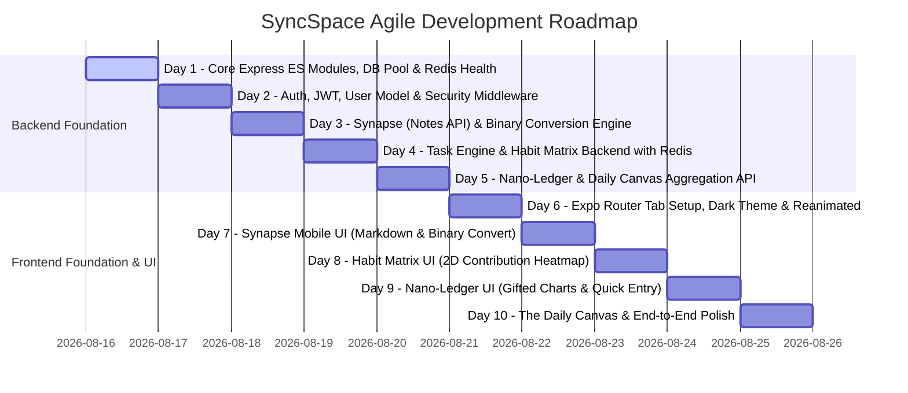

# SyncSpace: Architectural Blueprint & Agile Roadmap

SyncSpace is a unified personal operating system integrating **Synapse** (rapid capture notes & binary conversion), **Task Engine** (priority & recurrence), **Habit Matrix** (2D GitHub-style streak grid), **Nano-Ledger** (financial budget & analytics), and **The Daily Canvas** (unified CURRENT_DATE dashboard).

---

## 1. High-Concurrency Architecture (500+ Concurrent Users)

To handle 500+ concurrent mobile clients with sub-50ms latency:
1. **Connection Pooling**: PostgreSQL `pg.Pool` tuned with `max: 50` connections, connection timeout, and idle pool management.
2. **Two-Tier Caching via Redis (`ioredis`)**:
   - **Daily Canvas Cache**: Cache pre-computed aggregated daily timeline for `CURRENT_DATE` per user with short TTL (60s) or event-driven cache invalidation upon any task/habit/expense mutation.
   - **Rate Limiting**: Distributed rate limiting powered by `express-rate-limit` + `rate-limit-redis` to prevent burst storms.
   - **Session & User Metadata Cache**: Avoid repeated DB lookups for user preferences and tokens.
3. **Database Optimization**:
   - Composite indexes on `(user_id, date)` and `(user_id, status, due_date)`.
   - Connection lifecycle management and transactions for multi-entity writes (e.g., Synapse binary note-to-task conversion).

---

## 2. Day-by-Day Agile Roadmap

### Breakdown of Days:

- **Day 1 (Current Step)**: Backend Foundation — ES Modules, PostgreSQL Connection Pool, Redis Client, Rate Limiting, Health Check API.
- **Day 2**: Authentication & User Profile — JWT auth, bcrypt password hashing, token validation middleware, user timezone/currency preferences.
- **Day 3**: Synapse Module (Notes API) — Markdown note CRUD, tagging, and atomic "Binary Conversion" transaction (turning a note into a scheduled task with due date).
- **Day 4**: Task Engine & Habit Matrix Backend — Tasks CRUD (status, priority, due dates), Habits CRUD, Habit daily check-in logs, Redis caching for active streaks.
- **Day 5**: Nano-Ledger & Daily Canvas Backend — Income/Expense transactions, monthly budget tracking, and the high-speed cached `GET /api/canvas/today` aggregation endpoint.
- **Day 6**: Mobile Shell & Design System — Expo Router 5-tab layout, glassmorphic dark theme, Reanimated micro-interactions, API client with interceptors.
- **Day 7**: Synapse Mobile Screen — Markdown rapid capture, animated binary swipe/button conversion to task modal.
- **Day 8**: Habit Matrix Mobile Screen — 2D GitHub-style contribution heatmap grid, daily haptic toggles, streak badges.
- **Day 9**: Nano-Ledger Mobile Screen — Frictionless numerical keypad bottom sheet, Gifted Charts spending breakdown & budget progress ring.
- **Day 10**: The Daily Canvas & System Integration — Unified dynamic timeline, live widgets, pull-to-refresh with Redis cache revalidation, 60fps polished animations.

---

## 3. Scope for Day 1 Implementation

- Set up `backend/package.json` with `"type": "module"`.
- Configure environment schema with validation (`zod` + `dotenv`).
- Implement PostgreSQL Connection Pool (`pg`) with error events and graceful shutdown.
- Implement Redis Connection Client (`ioredis`) with reconnection strategies.
- Implement global middleware (Helmet, CORS, Compression, Morgan, Global Error Handler).
- Implement Redis-backed Distributed Rate Limiting.
- Expose `/api/health` checking PostgreSQL pool and Redis ping.
- Write full production PostgreSQL DDL schema in `src/db/schema.sql`.
